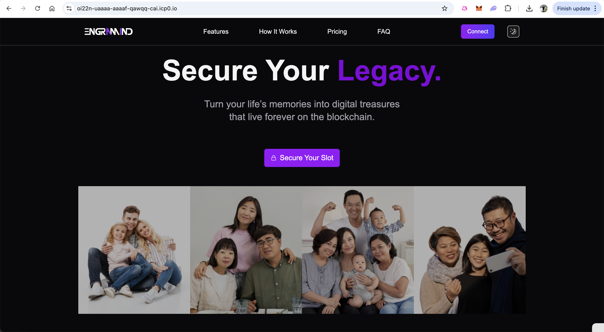

# `Engramind`

https://oi22n-uaaaa-aaaaf-qawqq-cai.icp0.io/

  
  

Watch a demo video [here](https://www.youtube.com/watch?v=sf742Rmc_gU).

A core component of the Engramind proposal is the use of AI to transform secured user data into an interactive virtual persona. This technology holds significant potential for digital legacy but also carries substantial ethical weight and risks that must be carefully considered, especially given the target audience's cautious stance towards AI.

# Concept and Creation

AI-powered personas, sometimes referred to as digital clones or twins, aim to create a dynamic representation of an individual based on their accumulated digital footprint. The process typically involves:

### Data Aggregation

Gathering vast amounts of personal data, which might include text messages, emails, social media posts and activity, voice recordings, photos, videos, and potentially even facial expressions. The richness and volume of data are crucial for capturing personality nuances.

### AI Modeling

Employing machine learning algorithms, particularly in Natural Language Processing (NLP), Natural Language Generation (NLG), and deep neural networks (like transformer-based models such as GPT), to analyze patterns in communication style, behavior, emotional responses, and context.

### Persona Generation

Creating a model that mimics the individual's thought processes and communication style, capable of generating responses or interacting in ways intended to reflect the person's mindset. Some systems utilize reinforcement learning or continual learning to allow the persona to evolve over time by incorporating new information or interactions.

### Interaction Interface

Making the persona accessible through interfaces like conversational chatbots, or potentially more immersive experiences like virtual reality (VR) environments or holograms in the future.
The primary goal in the context of Engramind is legacy preservation – enabling loved ones to interact with a semblance of the deceased individual, accessing memories and perhaps experiencing their personality in a novel way.
